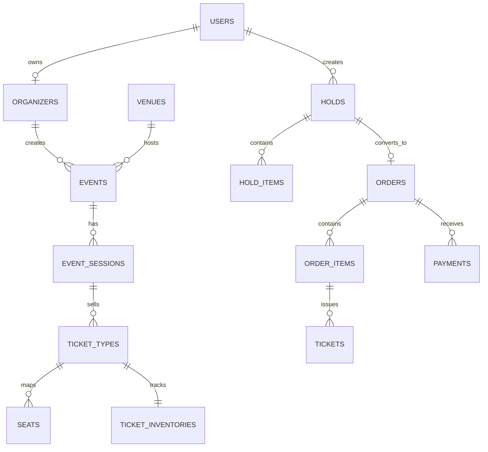

# Database design

## Hai mô hình vé

`ticket_types.inventory_mode` phân biệt:

- `ReservedSeating`: mỗi vị trí có một record trong `seats`; trạng thái sử dụng được quản lý qua `seat_allocations`.
- `GeneralAdmission`: không tạo từng ghế; số lượng được quản lý trong `ticket_inventories`.

## Hold và order

- `holds` là phiên giữ vé có thời hạn.
- `hold_items` lưu loại vé, số lượng và giá snapshot tại thời điểm giữ.
- `orders` được tạo tối đa một lần từ một hold nhờ unique constraint trên `hold_id`.
- `order_items` lưu snapshot sau khi xác nhận.
- `tickets` chỉ được phát hành sau khi thanh toán thành công; QR chỉ lưu hash, không lưu token thô.

## Độ tin cậy

- `idempotency_records`: ngăn request lặp tạo trạng thái trùng.
- `payment_webhook_events`: chống xử lý webhook thanh toán lặp.
- `outbox_messages`: ghi sự kiện nghiệp vụ cùng transaction trước khi worker gửi RabbitMQ.
- `audit_logs`: lưu hành động quản trị và thay đổi quan trọng.
