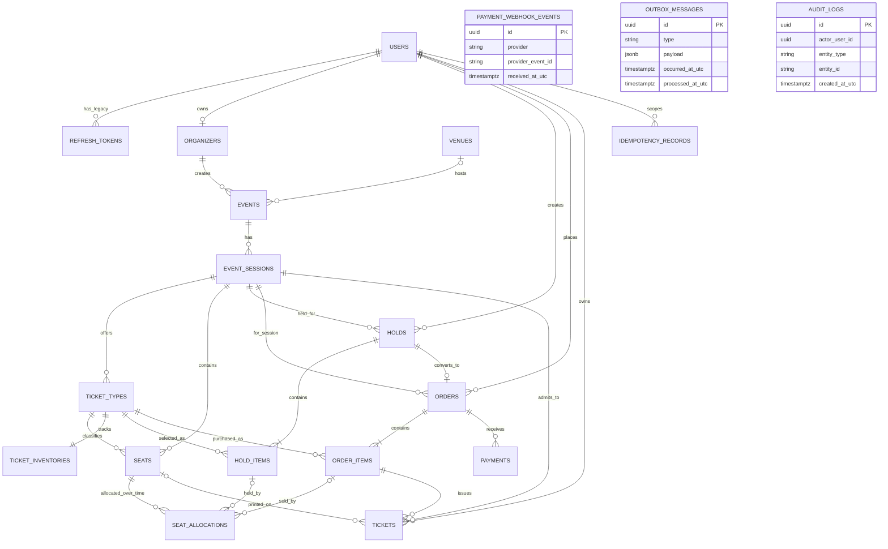
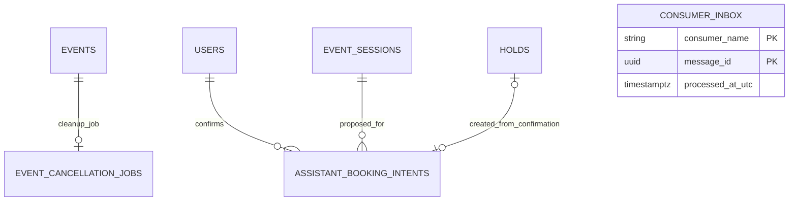

# ERD và mô hình dữ liệu

- **Schema gốc:** `database/init/001_initial_schema.sql` và `database/migrations/002_keycloak_identity.sql`.
- **Phạm vi:** Quan hệ logic/vật lý, khóa/index, cột version và thời gian UTC. Tài liệu ghi nhận schema hiện tại và các thay đổi mục tiêu của Giai đoạn 1; không tự áp dụng migration.

## ERD logic

```mermaid
erDiagram
    USERS ||--o{ REFRESH_TOKENS : has_legacy
    USERS ||--o| ORGANIZERS : owns
    ORGANIZERS ||--o{ EVENTS : creates
    VENUES o|--o{ EVENTS : hosts
    EVENTS ||--o{ EVENT_SESSIONS : has
    EVENT_SESSIONS ||--o{ TICKET_TYPES : offers
    EVENT_SESSIONS ||--o{ SEATS : contains
    TICKET_TYPES ||--o{ SEATS : classifies
    TICKET_TYPES ||--|| TICKET_INVENTORIES : tracks
    USERS ||--o{ HOLDS : creates
    EVENT_SESSIONS ||--o{ HOLDS : held_for
    HOLDS ||--|{ HOLD_ITEMS : contains
    TICKET_TYPES ||--o{ HOLD_ITEMS : selected_as
    HOLDS ||--o| ORDERS : converts_to
    USERS ||--o{ ORDERS : places
    EVENT_SESSIONS ||--o{ ORDERS : for_session
    ORDERS ||--|{ ORDER_ITEMS : contains
    TICKET_TYPES ||--o{ ORDER_ITEMS : purchased_as
    SEATS ||--o{ SEAT_ALLOCATIONS : allocated_over_time
    HOLD_ITEMS o|--o{ SEAT_ALLOCATIONS : held_by
    ORDER_ITEMS o|--o{ SEAT_ALLOCATIONS : sold_by
    ORDERS ||--o{ PAYMENTS : receives
    ORDER_ITEMS ||--o{ TICKETS : issues
    USERS ||--o{ TICKETS : owns
    EVENT_SESSIONS ||--o{ TICKETS : admits_to
    SEATS o|--o{ TICKETS : printed_on
    USERS ||--o{ IDEMPOTENCY_RECORDS : scopes
    PAYMENT_WEBHOOK_EVENTS {
        uuid id PK
        string provider
        string provider_event_id
        timestamptz received_at_utc
    }
    OUTBOX_MESSAGES {
        uuid id PK
        string type
        jsonb payload
        timestamptz occurred_at_utc
        timestamptz processed_at_utc
    }
    AUDIT_LOGS {
        uuid id PK
        uuid actor_user_id
        string entity_type
        string entity_id
        timestamptz created_at_utc
    }
```

`PAYMENT_WEBHOOK_EVENTS`, `OUTBOX_MESSAGES` và `AUDIT_LOGS` là bản ghi vận hành, hiện không có FK tới một aggregate nghiệp vụ. `AUDIT_LOGS.actor_user_id` nullable và không có FK để lịch sử audit vẫn tồn tại khi tài khoản bị xóa. `PAYMENT_WEBHOOK_EVENTS` khử trùng lặp sự kiện ngoài theo provider và provider event ID.

ERD thể hiện quan hệ đích một-một giữa `TICKET_TYPES` và `TICKET_INVENTORIES`. Schema hiện tại bảo đảm mỗi TicketType có tối đa một inventory nhờ unique constraint, nhưng chưa bắt buộc mọi TicketType phải có inventory; lệnh tạo TicketType cần tạo row inventory trong cùng transaction.

## Khóa, index, version và cột UTC

Mọi bảng dùng `id UUID` làm khóa chính. Tên FK và index dưới đây khớp SQL gốc, trừ nơi được ghi là đề xuất mục tiêu. Các cột `_at_utc` dùng PostgreSQL `timestamptz`; giá trị nullable biểu thị sự kiện chưa xảy ra hoặc một mốc thời gian tùy chọn.

### Định danh và catalog

| Bảng | Foreign keys | Unique keys và index quan trọng | Version | Cột UTC |
|---|---|---|---|---|
| `users` | None | `ux_users_normalized_email(normalized_email)`; migration 002 adds `ux_users_identity_subject(identity_subject)` | None | `created_at_utc`, `updated_at_utc` |
| `refresh_tokens` | `user_id -> users.id` (`CASCADE`) | `ux_refresh_tokens_token_hash(token_hash)`; `ix_refresh_tokens_user_id_expires_at_utc(user_id, expires_at_utc)` | None | `expires_at_utc`, `created_at_utc`, `revoked_at_utc` |
| `organizers` | `owner_user_id -> users.id` (`RESTRICT`) | `ux_organizers_owner_user_id(owner_user_id)`; `ux_organizers_slug(slug)` | None | `created_at_utc`, `updated_at_utc` |
| `venues` | None | No additional index in baseline | None | `created_at_utc`, `updated_at_utc` |
| `events` | `organizer_id -> organizers.id` (`RESTRICT`); `venue_id -> venues.id` (`SET NULL`) | `ux_events_organizer_slug(organizer_id, slug)`; `ix_events_status_sale_starts_at_utc(status, sale_starts_at_utc)`; `ix_events_category_status(category, status)` | None; target proposal: add for guarded status edits | `sale_starts_at_utc`, `sale_ends_at_utc`, `published_at_utc`, `created_at_utc`, `updated_at_utc` |
| `event_sessions` | `event_id -> events.id` (`CASCADE`) | `ux_event_sessions_event_start(event_id, starts_at_utc)`; `ix_event_sessions_status_starts_at_utc(status, starts_at_utc)` | None; target proposal: add for guarded status edits | `starts_at_utc`, `ends_at_utc`, `created_at_utc`, `updated_at_utc` |
| `ticket_types` | `event_session_id -> event_sessions.id` (`CASCADE`) | `ux_ticket_types_session_code(event_session_id, code)` | None; target proposal: add for guarded sales/config edits | `sale_starts_at_utc`, `sale_ends_at_utc`, `created_at_utc`, `updated_at_utc` |
| `seats` | `event_session_id -> event_sessions.id` (`RESTRICT`); `ticket_type_id -> ticket_types.id` (`CASCADE`) | `ux_seats_session_position(event_session_id, section, row_label, seat_number)`; `ix_seats_ticket_type_id(ticket_type_id)` | None | `created_at_utc` |

### Đặt vé và giao dịch

| Bảng | Foreign keys | Unique keys và index quan trọng | Version | Cột UTC |
|---|---|---|---|---|
| `ticket_inventories` | `ticket_type_id -> ticket_types.id` (`CASCADE`) | `ux_ticket_inventories_ticket_type_id(ticket_type_id)` | Đã có `version BIGINT NOT NULL DEFAULT 0`; EF Core đánh dấu là concurrency token | `updated_at_utc` |
| `holds` | `user_id -> users.id` (`RESTRICT`); `event_session_id -> event_sessions.id` (`RESTRICT`) | `ux_holds_user_idempotency(user_id, idempotency_key)`; `ix_holds_status_expires_at_utc(status, expires_at_utc)` | None; target proposal: add for state-transition compare-and-swap | `expires_at_utc`, `created_at_utc`, `updated_at_utc` |
| `hold_items` | `hold_id -> holds.id` (`CASCADE`); `ticket_type_id -> ticket_types.id` (`RESTRICT`) | `ix_hold_items_hold_id(hold_id)` | None | None |
| `orders` | `user_id -> users.id` (`RESTRICT`); `event_session_id -> event_sessions.id` (`RESTRICT`); `hold_id -> holds.id` (`RESTRICT`) | `ux_orders_order_number(order_number)`; `ux_orders_hold_id(hold_id)`; `ix_orders_user_id_created_at_utc(user_id, created_at_utc DESC)` | None; target proposal: add for state-transition compare-and-swap | `created_at_utc`, `updated_at_utc` |
| `order_items` | `order_id -> orders.id` (`CASCADE`); `ticket_type_id -> ticket_types.id` (`RESTRICT`) | `ix_order_items_order_id(order_id)` | None | None |
| `seat_allocations` | `seat_id -> seats.id` (`RESTRICT`); `hold_item_id -> hold_items.id` (`SET NULL`); `order_item_id -> order_items.id` (`SET NULL`) | Partial unique `ux_seat_allocations_active_seat(seat_id) WHERE status IN ('Held','Sold')`; `ix_seat_allocations_status_expires_at_utc(status, expires_at_utc)` | None; target proposal: add for state-transition compare-and-swap | `expires_at_utc`, `created_at_utc`, `updated_at_utc` |
| `payments` | `order_id -> orders.id` (`CASCADE`) | `ux_payments_idempotency_key(idempotency_key)`; partial unique `ux_payments_provider_transaction_id(provider_transaction_id) WHERE provider_transaction_id IS NOT NULL`; `ix_payments_order_id(order_id)` | None; target proposal: add for state-transition compare-and-swap | `paid_at_utc`, `created_at_utc`, `updated_at_utc` |
| `tickets` | `order_item_id -> order_items.id` (`RESTRICT`); `user_id -> users.id` (`RESTRICT`); `event_session_id -> event_sessions.id` (`RESTRICT`); `seat_id -> seats.id` (`RESTRICT`, nullable) | `ux_tickets_ticket_code(ticket_code)`; `ux_tickets_qr_token_hash(qr_token_hash)`; partial unique `ux_tickets_active_seat(seat_id) WHERE seat_id IS NOT NULL AND status IN ('Issued','Used')`; `ix_tickets_session_status(event_session_id, status)`; `ix_tickets_user_id(user_id)` | None; target proposal: add for state-transition compare-and-swap | `issued_at_utc`, `checked_in_at_utc` |

### Độ tin cậy và audit

| Bảng | Foreign keys | Unique keys và index quan trọng | Version | Cột UTC |
|---|---|---|---|---|
| `payment_webhook_events` | None | `ux_payment_webhook_provider_event(provider, provider_event_id)`; `ix_payment_webhook_events_processed_at_utc(processed_at_utc)` | None | `received_at_utc`, `processed_at_utc` |
| `idempotency_records` | `user_id -> users.id` (`CASCADE`) | `ux_idempotency_user_scope_key(user_id, scope, key)`; `ix_idempotency_records_expires_at_utc(expires_at_utc)` | None | `expires_at_utc`, `created_at_utc`, `updated_at_utc` |
| `outbox_messages` | None | Partial `ix_outbox_pending(next_attempt_at_utc, occurred_at_utc) WHERE processed_at_utc IS NULL` | None | `occurred_at_utc`, `processed_at_utc`, `next_attempt_at_utc` |
| `audit_logs` | No FK on nullable `actor_user_id` | `ix_audit_logs_entity(entity_type, entity_id, created_at_utc DESC)`; `ix_audit_logs_actor(actor_user_id, created_at_utc DESC)` | None | `created_at_utc` |

## Chiến lược version

Schema vật lý hiện chỉ có cột `version` trên `ticket_inventories`; EF Core đánh dấu cột này là concurrency token. Nguyên tắc thiết kế Giai đoạn 1 yêu cầu mỗi chuyển trạng thái kiểm tra cả trạng thái hiện tại mong đợi và version. Đề xuất migration bổ sung `version BIGINT NOT NULL DEFAULT 0` không âm cho `events`, `event_sessions`, `ticket_types`, `holds`, `seat_allocations`, `orders`, `payments` và `tickets`. Tăng version ở mỗi lần cập nhật trạng thái/cấu hình được chấp nhận và đưa version mong đợi vào điều kiện UPDATE. Version cũ phải khiến row giữ nguyên và trả xung đột concurrency.

Đây là thiết kế mục tiêu, chưa có trong SQL hoặc domain mapping. Trong thiết kế này, `users`, `organizers`, `venues`, snapshot từng dòng, webhook receipt, idempotency record, outbox message và audit log không cần version trạng thái nghiệp vụ.

## Toàn vẹn dữ liệu và mô hình sức chứa

- Quy tắc sức chứa đã xác nhận áp dụng theo `TicketType`; không cần thêm `EventSession.capacity` tổng.
- Với `GeneralAdmission`, `ticket_types.capacity` phải bằng `ticket_inventories.total_quantity`. Số lượng khả dụng là `total_quantity - held_quantity - sold_quantity` và không được âm.
- Với `ReservedSeating`, `ticket_types.capacity` phải bằng số ghế active được gán cho TicketType trong session. Khả năng chọn ghế dựa trên `seat_allocations` và trạng thái ticket active; bộ đếm inventory không được cấp ghế.
- Giữ một row `ticket_inventories` cho mỗi `TicketType`, phù hợp với seed hiện tại và EF Core navigation. Với General Admission, row này là nguồn dữ liệu quyết định. Với Reserved Seating, `total_quantity` phản chiếu `TicketType.capacity`, còn `held_quantity` và `sold_quantity` là projection của seat allocation active; trạng thái ghế/allocation vẫn là nguồn dữ liệu quyết định. Cập nhật projection trong cùng transaction và đối soát từ allocation; không dùng bộ đếm projection để cấp ghế.
- `ux_seat_allocations_active_seat` và `ux_tickets_active_seat` ngăn trùng lặp trong từng bảng. Khi booking, cũng phải cập nhật seat allocation và phát hành/hủy ticket trong một transaction để cả hai bản ghi mô tả cùng vòng đời của ghế.
- FK hiện chưa đảm bảo `seats.event_session_id` bằng `ticket_types.event_session_id`; Hold, HoldItem, Order và Hold nguồn cùng session/Customer; hoặc user/session/seat của Ticket khớp OrderItem. Command phải kiểm tra các quan hệ này trong một transaction; có thể thêm composite constraint bằng migration sau.
- Siết `ck_seat_allocations_state` bằng migration: trạng thái `Held` chỉ có HoldItem và expiry; `Sold` chỉ có OrderItem và không expiry; `Released` không được xem là active. Check hiện tại chưa cấm đồng thời đặt cả hai tham chiếu item.
- FK hạn chế xóa dữ liệu nghiệp vụ đã có Order, Ticket hoặc allocation. Dùng chuyển trạng thái và retention policy thay vì cascade xóa lịch sử mua vé.

## Quy ước UTC và tiền tệ

- Mọi thời điểm dùng PostgreSQL `timestamptz` và tên cột kết thúc bằng `_at_utc`; API nhận/trả timestamp RFC 3339 chuẩn hóa UTC. Chỉ đổi theo `venues.time_zone` khi hiển thị.
- Command ghi created/updated/paid/checked-in/outbox timestamp bằng `decision_time_utc` lấy sau khóa; đặc biệt Hold.created_at_utc và expiry cách nhau đúng 10 phút. Không dùng mặc định `now()` ở đầu transaction đã chờ lâu làm thời điểm quyết định.
- Sale window tùy chọn dùng UTC instant nullable. Mỗi giá trị là một instant hoặc `NULL`; không lưu giờ địa phương vào các cột này.
- Giá tiền dùng `numeric(14,2)` cùng currency ISO 4217 ba ký tự. Giá trị mặc định và seed hiện tại là `VND`. Snapshot giá và số lượng nằm ở `hold_items` rồi được sao chép sang `order_items` lúc checkout.
- `ticket_types.price` có constraint không âm. Cột sale window tồn tại ở cả `events` và `ticket_types`; quy tắc kết hợp hai cửa sổ được ghi tại `phase-1-business-rules.md`.

## Bổ sung mục tiêu sau khi chốt vòng đời và API

Các mục này là **thiết kế để viết migration ở giai đoạn triển khai**, chưa có trong 20 bảng baseline. Chính sách đã được người dùng xác nhận ngày 07/10/2026; xác nhận giảng viên còn **Decision Pending GV-01**, hạn 11/10/2026. Không suy diễn rằng bảng/cột mục tiêu đã tồn tại.

Mọi cột thời gian bổ sung dùng TIMESTAMPTZ UTC; created/updated/expires khi có là NOT NULL, còn claimed-until/processed/completed/consumed có thể NULL trước khi xảy ra hành động tương ứng.

| Đối tượng | Bổ sung / ràng buộc mục tiêu | Lý do và cách kiểm tra |
|---|---|---|
| `holds` | `currency CHAR(3) NOT NULL` với `CHECK currency = 'VND'`; version như trên | Snapshot tiền tệ cùng giá; checkout không đọc lại currency mới từ TicketType. |
| `hold_items`, `order_items` | `max_per_order_snapshot INTEGER NOT NULL CHECK (> 0)`; unique `(hold_id, ticket_type_id)` và `(order_id, ticket_type_id)` | Gộp quantity theo loại trước khi kiểm tra, lưu một dòng mỗi loại; checkout copy cả giá/lượng/giới hạn đã chấp nhận. |
| `tickets` | `item_ordinal INTEGER NOT NULL CHECK (> 0)`; unique `(order_item_id, item_ordinal)` | Mỗi đơn vị vé có một ordinal từ 1..quantity; command kiểm tra đủ/số lượng tối đa. Chống issue lặp cả GA không có seat ID. |
| `tickets` | `qr_key_id VARCHAR(80) NOT NULL`, `qr_nonce VARCHAR(64) NOT NULL`; giữ `qr_token_hash` hiện có | Tái tạo token HMAC có domain/version từ ticket ID + nonce + key bí mật; DB không giữ raw QR. Giữ key cũ để vé đang hiệu lực vẫn hiển thị/kiểm tra được. |
| `payments` | `failure_reason VARCHAR(80) NULL`; partial unique `ux_payments_pending_order(order_id) WHERE status = 'Pending'`; `ux_payments_settled_order(order_id) WHERE status IN ('Succeeded','Refunded')` | Một attempt đang xử lý và một kết quả đã thanh toán mỗi Order; Failed là terminal, retry tạo row mới. Pending bị hết hạn/hủy ghi lý do tương ứng. |
| `payment_webhook_events` | `payload_hash VARCHAR(64) NOT NULL`, `processing_outcome VARCHAR(24) NULL`, `processing_reason VARCHAR(100) NULL` | Hash nội dung nghiệp vụ nhận diện cùng ID khác payload; outcome Processed/Ignored và processed_at_utc commit cùng state mutation. Duplicate trả kết quả receipt mà không áp dụng lại. |
| `idempotency_records` | `resource_type VARCHAR(80) NULL`, `resource_id UUID NULL`, `response_headers JSONB NULL`; giữ row ledger sau `expires_at_utc` | `expires_at_utc` là hạn cache response 24 giờ, không phải quyền tái sử dụng key. Sau hạn có thể xóa body/header nhạy cảm; giữ scope/key/hash/outcome/resource pointer theo retention nghiệp vụ. Pointer đa hình không có FK; command bảo đảm liên kết. |
| Domain idempotency key | `holds.idempotency_key`/`payments.idempotency_key` lưu SHA-256 hex của actor + scope + client key, không lưu trực tiếp client key | Hòa giải unique theo user trên Hold và unique toàn bảng Payment với scope API theo operation/resource. `idempotency_records` vẫn giữ client key ở scope tương ứng để kiểm tra hash. |
| `outbox_messages` | `claim_token UUID NULL`, `claimed_until_utc TIMESTAMPTZ NULL` | Dispatcher claim/lease trước publish; marker xử lý phải khớp token, lease hết hạn có thể tiếp quản. |
| `consumer_inbox` (bảng mới) | PK `(consumer_name VARCHAR(120), message_id UUID)`; `processed_at_utc TIMESTAMPTZ NOT NULL`; không FK tới producer outbox | Dedupe consumer; inbox và side effect cùng transaction. Không giả định publisher/consumer cùng database. |
| `event_cancellation_jobs` (bảng mới) | `id UUID PK`; `event_id UUID NOT NULL UNIQUE FK events(id) RESTRICT`; `status` Pending/Running/Completed; claim_token, claimed_until_utc, last_error; created_at_utc, updated_at_utc, completed_at_utc | Inbox + tạo job commit cùng nhau rồi ack. Worker cleanup từng booking qua Booking command, retry từ các row chưa xử lý; chỉ Completed sau khi toàn Event đã được xử lý. Claim token bảo vệ quyền worker, không cần business version. |
| `assistant_booking_intents` (bảng mới) | `id UUID PK`; `user_id FK users(id) RESTRICT`; `event_session_id FK event_sessions(id) RESTRICT`; selection/quote JSONB, quote_hash, proof_key_id/proof_nonce; `hold_id UUID NULL UNIQUE FK holds(id) RESTRICT`; created_at_utc, expires_at_utc, consumed_at_utc | Proof chỉ dùng từ UI Customer, gắn quote/user/expiry; consume intent và tạo Hold cùng transaction. TTL kỹ thuật 5 phút. Ledger không lưu raw proof; tái tạo từ metadata có khóa riêng. |

```mermaid
erDiagram
    EVENTS ||--o| EVENT_CANCELLATION_JOBS : cleanup_job
    USERS ||--o{ ASSISTANT_BOOKING_INTENTS : confirms
    EVENT_SESSIONS ||--o{ ASSISTANT_BOOKING_INTENTS : proposed_for
    HOLDS o|--o| ASSISTANT_BOOKING_INTENTS : created_from_confirmation
    CONSUMER_INBOX {
        string consumer_name PK
        uuid message_id PK
        timestamptz processed_at_utc
    }
```

Mỗi TicketType phải có inventory row được tạo cùng transaction. Seat map được quản lý bằng TicketType.version; không cần thêm version riêng cho Seat trong thiết kế này. Trạng thái Session SoldOut là projection và không thay nguồn kiểm tra quota.

Order API `paymentExpiresAtUtc` lấy từ Hold, không thêm cột deadline thứ hai. Hold vẫn Active khi Order PendingPayment; Held allocation vẫn tham chiếu HoldItem cho tới success. Sau thành công, allocation Sold tham chiếu OrderItem; khi hủy vé đã check-in giữ Sold và checked_in_at_utc. Do đó sold không luôn bằng số Ticket hiện có status Issued/Used: vé Cancelled đã dùng vẫn chiếm consumption.

`admissionValid`, `checkInAllowed` và lý do vô hiệu là dữ liệu suy ra từ Ticket + Event/Session + đồng hồ, không phải cột trạng thái độc lập. API dùng `X-Expected-Version` cho optimistic concurrency trên aggregate; không dùng version làm ETag cho response chứa dữ liệu suy ra theo thời gian.

**Kịch bản dữ liệu dự kiến DB-TC-01..06:** thiếu inventory khi tạo type phải rollback; trùng ordinal hoặc pending Payment bị constraint chặn; currency/limit snapshot giữ nguyên sau chỉnh catalog; mất response cache không tạo lại booking; key rotation vẫn kiểm tra QR của vé active; restart worker tiếp tục cancellation job/inbox không lặp side effect.

## Tài liệu liên quan

- [Quy tắc nghiệp vụ Giai đoạn 1](phase-1-business-rules.md)
- [Actor và use case Giai đoạn 1](phase-1-actors-and-use-cases.md)
- [Toàn bộ sản phẩm và cổng nghiệm thu Giai đoạn 1](phase-1-design-index.md)
- [Runbook khởi tạo database và chống overselling](../database/README.md)
