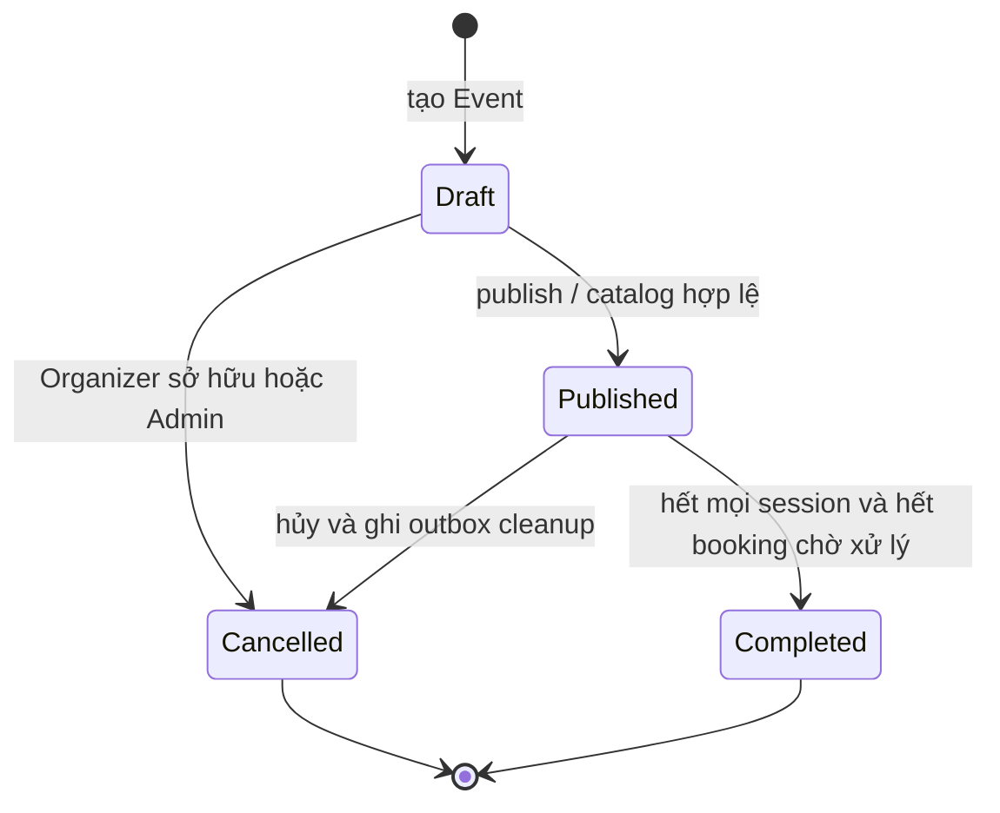
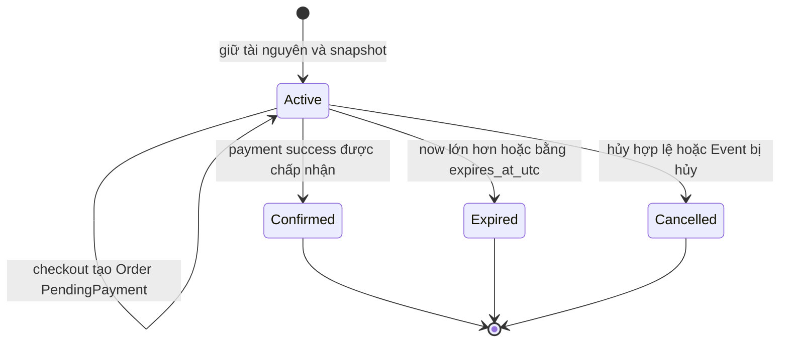
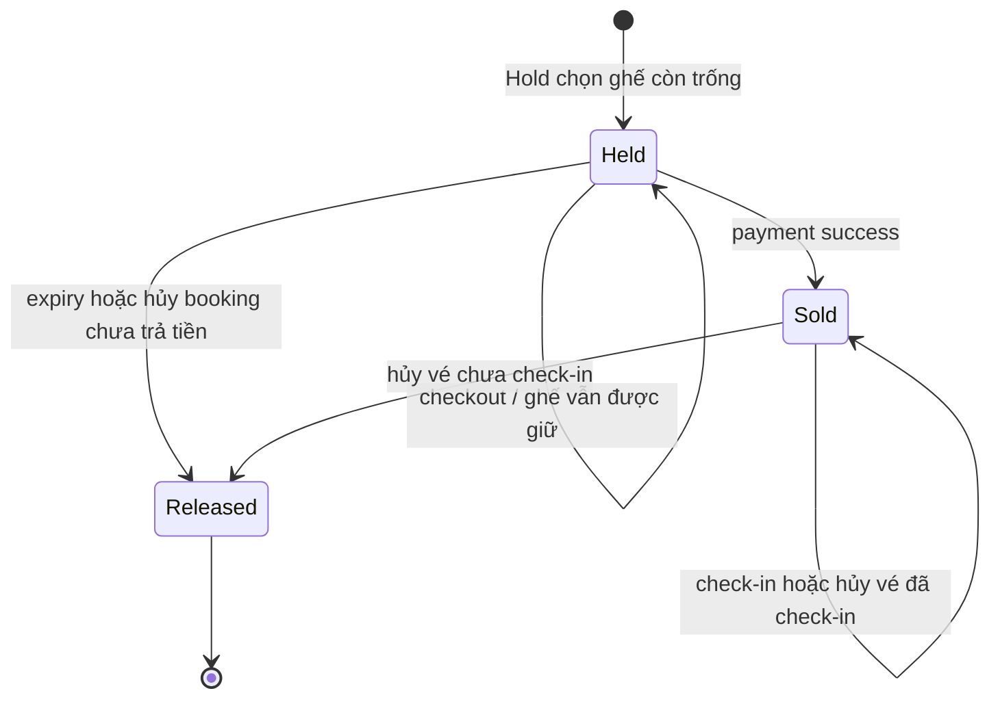

# State diagrams và quy tắc chuyển trạng thái

Ngày thiết kế: **07/10/2026**. Các chính sách nghiệp vụ dưới đây đã được người dùng chốt trong cuộc trao đổi. **Decision Pending GV-01:** giảng viên chưa xác nhận bộ thiết kế; hạn chốt **11/10/2026**. Đây là hợp đồng thiết kế cho triển khai sau, không phải mô tả các API đã chạy.

Tài liệu liên quan: [business rules](phase-1-business-rules.md), [sequence diagrams](phase-1-sequence-diagrams.md), [API contract](phase-1-api-contract.md), [ERD](database.md), [ADR](adr/README.md).

## 1. Nguyên tắc chung

| ID | Bất biến |
|---|---|
| INV-01 | Mọi thay đổi booking được commit trong PostgreSQL. Redis và RabbitMQ không quyết định ai có ghế. |
| INV-02 | Hold gồm các TicketType của đúng một EventSession, tạo toàn bộ hoặc rollback toàn bộ. |
| INV-03 | Một Hold có tối đa một Order. Checkout tạo Order nhưng giữ Hold `Active`; `Confirmed` chỉ có nghĩa là đã thanh toán thành công. |
| INV-04 | Hold có hạn 10 phút; checkout, đọc và retry không gia hạn. Đúng `expires_at_utc` là hết hạn. |
| INV-05 | Cửa sổ bán chỉ chặn Hold mới. Hold còn hiệu lực được checkout/pay đến hết hạn gốc dù đã đóng bán hoặc session bắt đầu. Event/Session bị hủy vẫn chặn giao dịch. |
| INV-06 | Payment success, Order Paid, Hold Confirmed, tài nguyên Held → Sold, Ticket issuance và outbox cùng một transaction. |
| INV-07 | Mỗi ghế có tối đa một allocation Held/Sold. GA luôn có `held >= 0`, `sold >= 0`, `held + sold <= total`. |
| INV-08 | Một payment attempt đã Failed không được sửa lại Pending/Succeeded. Retry tạo Payment mới khi Order còn hạn; chỉ một attempt Pending và một payment đã thành công cho mỗi Order. |
| INV-09 | Hủy/expiry/duplicate callback không giải phóng hoặc phát hành hai lần; mutation kiểm tra trạng thái và version. |
| INV-10 | Hủy vé chưa check-in trả tài nguyên. Hủy vé đã check-in giữ lượng đã dùng và giữ `checked_in_at_utc`; allocation vẫn Sold. |
| INV-11 | Cancellation không hoàn tiền: Payment Succeeded và số tiền snapshot giữ nguyên. Refunded có trong enum nền nhưng chưa có đường chuyển trạng thái trong phạm vi này. |
| INV-12 | Check-in chỉ từ Issued, đúng session/ownership, Event chưa hủy và `starts_at_utc - 60 phút <= now < ends_at_utc`. |
| INV-13 | Hiệu lực tham dự còn phụ thuộc Event/Session. Ticket Issued dưới Event Cancelled không còn hiệu lực, kể cả khi worker chưa cập nhật row Ticket. |
| INV-14 | Mọi lệnh lấy đồng hồ PostgreSQL sau khi chờ khóa, dùng một `decision_time_utc` cho lần chuyển trạng thái; không dùng thời điểm bắt đầu transaction đã cũ. |
| INV-15 | Hạn mức là tổng quantity của từng TicketType trong một Hold/Order so với `max_per_order` tại lúc Hold được chấp nhận; không cộng dồn giữa Order. |

Mỗi mũi tên là một mutation nguyên tử hoặc một bước workflow có chỉ rõ ranh giới transaction. Mũi tên tự quay lại chỉ mô tả quan sát/replay, không tăng version nếu không có thay đổi. Chuyển trạng thái ngoài bảng bị từ chối; quyền Admin vẫn phải tuân theo state guard.

## 2. Event



| Chuyển trạng thái | Điều kiện / tác động | Kịch bản |
|---|---|---|
| Draft → Published | Có session hợp lệ, TicketType có quota/giá/giới hạn hợp lệ, seat map và inventory khớp mode; kiểm tra ownership và version. | ST-E01: thiếu quota hoặc seat map sai thì không publish. |
| Draft/Published → Cancelled | Organizer sở hữu hoặc Admin; có lý do. Khóa Event độc quyền, cập nhật trạng thái + audit + outbox trong một transaction. | ST-E02: hủy cạnh tranh payment/check-in chỉ có một thứ tự commit hợp lệ. |
| Published → Completed | Mọi session đã kết thúc, không còn Hold Active/Order PendingPayment. Hoàn tất session tương ứng trong workflow; không cắt ngang hạn Hold đã chấp nhận. | ST-E03: còn pending booking thì không hoàn tất Event. |
| Cancelled/Completed → bất kỳ trạng thái khác | Không hỗ trợ mở lại trong phạm vi này. | ST-E04: không có lệnh hồi sinh Event. |

Hủy Event trả 202 sau khi commit trạng thái Cancelled và outbox. Ngay lúc đó catalog/hold/checkout/payment/check-in bị chặn bởi parent gate. Worker cleanup các Hold/Order/Ticket theo transaction nhỏ, có thể retry; thời gian xử lý các row con không làm chúng tiếp tục có hiệu lực tham dự.

`EventSession` có `Scheduled, OnSale, SoldOut, Cancelled, Completed`. `Cancelled/Completed` là gate kết thúc; Scheduled/OnSale/SoldOut hỗ trợ hiển thị lịch bán/khả dụng, phải suy ra lại theo Event, thời gian và nguồn quota. Không từ chối Hold chỉ vì một nhãn SoldOut bị cũ. Không nâng khóa shared EventSession thành exclusive để cập nhật nhãn SoldOut trong transaction booking; việc tính lại projection chạy riêng. `TicketType` hiện không có cột status.

## 3. Hold



| Chuyển trạng thái | Tác động cùng transaction | Kịch bản |
|---|---|---|
| Tạo → Active | Snapshot giá VND, số lượng và hạn mức từng TicketType; giữ GA/ghế; expiry = thời điểm quyết định + 10 phút. | ST-H01: lỗi một loại vé rollback mọi giữ chỗ. |
| Active → Active tại checkout | Tạo một Order PendingPayment cùng items snapshot. Allocation vẫn Held, GA vẫn ở held_quantity; không cập nhật expiry. | ST-H02: hai checkout trả cùng Order. |
| Active → Confirmed | Chỉ khi áp dụng Payment success cho Order đang PendingPayment và decision time trước expiry. | ST-H03: không Confirmed tại checkout. |
| Active → Expired | Giải phóng tài nguyên; Order PendingPayment nếu có → Expired; Payment Pending nếu có → Failed với lý do ORDER_EXPIRED. | ST-H04: expiry lặp không giảm counter hai lần. |
| Active → Cancelled | Customer sở hữu hoặc Admin, hay worker xử lý Event cancellation; Order PendingPayment → Cancelled, Payment Pending → Failed. | ST-H05: hủy Hold sau checkout hủy luôn pending Order. |
| Confirmed/Expired/Cancelled | Terminal; hủy vé/đơn đã trả tiền không sửa Hold Confirmed thành Cancelled. | ST-H06: callback trễ không hồi sinh Hold. |

## 4. Order

```mermaid
stateDiagram-v2
    [*] --> PendingPayment : checkout Hold Active
    PendingPayment --> PendingPayment : attempt thất bại / còn hạn để retry
    PendingPayment --> Paid : payment success
    PendingPayment --> Expired : hết hạn Hold nguồn
    PendingPayment --> Cancelled : Customer sở hữu / Admin / Event hủy
    Paid --> Cancelled : Admin hủy cả Order hoặc Event hủy
    Paid --> Paid : Admin hủy riêng một Ticket
    Expired --> [*]
    Cancelled --> [*]
    state Refunded
    note right of Refunded
        Có trong enum nền
        Chưa bật workflow refund
    end note
```

`paymentExpiresAtUtc` trong API lấy từ `holds.expires_at_utc`, không tạo đồng hồ thứ hai. Tạo attempt mới không thay đổi hạn này.

- PendingPayment → Paid: tổng tiền/currency lấy từ Order, số vé phát hành bằng quantity từng OrderItem.
- PendingPayment → Expired/Cancelled: giải phóng held quota một lần, không có Ticket đã phát hành.
- Paid → Cancelled: vô hiệu toàn bộ Ticket; vé chưa dùng trả chỗ, vé đã dùng giữ consumption. Giữ tổng tiền và Payment Succeeded để thể hiện lịch sử.
- Hủy riêng Ticket giữ Order Paid, kể cả nhiều Ticket bị hủy riêng. Paid diễn tả khoản mua đã thanh toán; hiệu lực tham dự được đọc trên từng Ticket cùng parent gate.
- Không có Cancelled/Expired → Paid; Order terminal không checkout/payment lại. Muốn mua tiếp phải tạo Hold mới với key mới.

**Kịch bản:** ST-O01 payment failure còn thời gian thì tạo attempt mới; ST-O02 toàn bộ quantity được issue đúng một lần; ST-O03 hủy một Ticket không sửa tổng tiền Order; ST-O04 callback success sau Expired không phát vé.

## 5. Payment

```mermaid
stateDiagram-v2
    [*] --> Pending : tạo attempt Mock
    Pending --> Succeeded : callback hợp lệ và booking còn hiệu lực
    Pending --> Failed : callback failure / booking hết hạn hoặc bị hủy
    Succeeded --> [*]
    Failed --> [*]
    state Refunded
    note right of Refunded
        Chưa hỗ trợ refund
    end note
```

Customer chọn `Succeeded` hoặc `Failed` cho simulator. Simulator phát callback qua danh tính dịch vụ riêng; body Customer không trực tiếp ghi Payment Succeeded. API không cho Customer/Admin bỏ qua callback bằng sửa status.

Một Order có tối đa một attempt Pending. Sau Failed, Customer có thể tạo attempt mới trong hạn gốc. Mỗi attempt terminal là bất biến; callback cho attempt cũ không tác động attempt mới. Kết quả terminal trái ngược đến sau được ghi nhận là ignored/audit; cùng provider event ID nhưng payload khác là lỗi conflict.

Đối với **Mock**, callback success đến sau hủy/expiry được nhận với kết quả ignored, không có tiền thật đã capture; booking không được hồi sinh. Tích hợp provider thật sau này phải bổ sung settlement/refund/reconciliation trước khi dùng quy tắc này. Payment đã Succeeded vẫn Succeeded khi Order/Ticket bị hủy.

**Kịch bản:** ST-P01 chỉ một attempt Pending; ST-P02 failed rồi retry tạo ID mới; ST-P03 callback success lặp không tăng doanh thu/issue vé; ST-P04 cùng event ID khác payload báo conflict; ST-P05 callback success trễ không cấp vé.

## 6. Seat allocation



Ghế khả dụng nghĩa là active và không có allocation Held/Sold; không phải một giá trị status mới của bảng allocation. Released là lịch sử terminal. Khi ghế được đặt lại, tạo allocation **mới**, không đổi row Released về Held.

- Held có `hold_item_id`, expiry; chưa có `order_item_id` dù Order có thể đã PendingPayment. Điều này khớp Hold vẫn Active.
- Sold có `order_item_id`, không expiry, không HoldItem reference; lịch sử Hold truy ra qua Order.
- Released giữ tham chiếu lịch sử cuối cùng; không chiếm unique active-seat.
- Hủy Ticket đã dùng giữ Sold và `checked_in_at_utc` để ghế không được bán lại.
- Inventory của ReservedSeating được cập nhật theo số allocation Held/Sold trong cùng transaction. Reconcile chỉ sửa projection theo nguồn ghế/allocation.
- GA không có SeatAllocation: tạo Hold làm held +q; success held -q/sold +q; expiry/hủy pending held -q; hủy vé chưa dùng sold -1; hủy vé đã dùng không đổi.

**Kịch bản:** ST-A01 hai Customer tranh một seat chỉ một Held; ST-A02 Released rồi đặt lại tạo row mới; ST-A03 hủy Used không làm seat khả dụng; ST-A04 projection lệch không cấp được ghế trùng.

## 7. Ticket

```mermaid
stateDiagram-v2
    [*] --> Issued : payment success / một row mỗi đơn vị
    Issued --> Used : check-in hợp lệ
    Issued --> Cancelled : Admin hoặc Event cancellation / trả chỗ
    Used --> Cancelled : Admin hoặc Event cancellation / giữ consumption
    Used --> Used : quét lặp / báo đã sử dụng
    Cancelled --> [*]
    state Refunded
    note right of Refunded
        Chưa hỗ trợ refund
    end note
```

Check-in cập nhật Issued → Used và `checked_in_at_utc` nguyên tử. Hai lần quét đồng thời: một lần thành công, lần còn lại `TICKET_ALREADY_USED`; retry cùng idempotency key trả kết quả cũ. Quét khác key là yêu cầu mới và bị từ chối nếu đã Used.

`admissionValid` có nghĩa vé còn quyền tham dự (Issued, parent không Cancelled/Completed); `checkInAllowed` còn yêu cầu đúng cửa sổ check-in. Không đánh đồng chưa đến giờ check-in với vé đã hủy. Đúng giờ đóng check-in bị từ chối. QR chỉ là bằng chứng nhận diện; luôn kiểm tra lại trạng thái DB và quyền Organizer/Admin.

**Kịch bản:** ST-T01 Issued tại đầu cửa sổ được check-in; ST-T02 đúng ends_at_utc bị từ chối; ST-T03 cancel/check-in tranh nhau chỉ commit một thứ tự và xét quota theo kết quả thực; ST-T04 Event Cancelled chặn Ticket còn row Issued; ST-T05 hủy Used giữ checked_in_at_utc.

## 8. Trạng thái phối hợp

| Tình huống | Hold | Order | Payment liên quan | Allocation / GA | Ticket |
|---|---|---|---|---|---|
| Giữ thành công | Active | Chưa có | Chưa có | Held / held +q | Chưa có |
| Checkout | Active | PendingPayment | Chưa có hoặc Pending | Giữ nguyên Held | Chưa có |
| Attempt thất bại, còn hạn | Active | PendingPayment | Failed | Giữ nguyên Held | Chưa có |
| Thanh toán thành công | Confirmed | Paid | Succeeded | Sold / held -q, sold +q | Issued |
| Hết hạn chưa thanh toán | Expired | Expired nếu có | Pending → Failed | Released / held -q | Chưa có |
| Hủy chưa thanh toán | Cancelled | Cancelled nếu có | Pending → Failed | Released / held -q | Chưa có |
| Hủy riêng vé chưa dùng | Confirmed | Paid | Succeeded | Released / sold -1 | Cancelled |
| Hủy riêng vé đã dùng | Confirmed | Paid | Succeeded | Sold / không đổi | Cancelled, còn checked-in timestamp |
| Hủy cả đơn đã trả tiền | Confirmed | Cancelled | Succeeded | Xử lý từng vé theo đã dùng/chưa dùng | Tất cả Cancelled |
| Event vừa hủy, cleanup chưa xong | Có thể còn row cũ | Có thể còn row cũ | Không được áp dụng success mới | Worker giải phóng theo policy | admissionValid=false ngay |
| Hủy Event đã cleanup | Theo từng booking | Cancelled hoặc terminal cũ | Succeeded giữ lịch sử; Pending → Failed | Theo từng vé | Cancelled hoặc terminal cũ |

## 9. Điểm cần cập nhật khi triển khai

ERD chi tiết theo [database.md](database.md): version trạng thái; currency/limit snapshot cho Hold; uniqueness theo đơn vị phát hành vé; một pending/settled Payment mỗi Order; ledger idempotency; QR metadata; inbox cho consumer. Chưa áp dụng migration ở Giai đoạn 1.

Cổng nghiệm thu: chạy các kịch bản ST-* cùng [sequence scenarios](phase-1-sequence-diagrams.md) trong giai đoạn implementation. Ở Giai đoạn 1, kiểm tra bằng đối chiếu trạng thái/guard/transaction; không dùng việc có sơ đồ làm bằng chứng chống oversell đã chạy thực tế.

