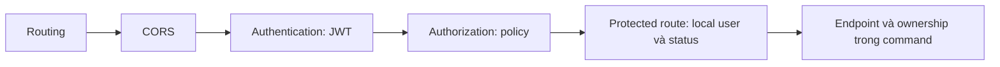

# Giai đoạn 2 — JWT, role policy và middleware

**Cập nhật: 08/10/2026. Phạm vi: hai đầu việc đầu.**

## 1. Hợp đồng token

Xem [cấu hình và bằng chứng Keycloak](phase-2-token-contract.md). API nhận **access token** qua `Authorization: Bearer <token>`.

| Claim / thuộc tính | Kiểm tra ở API |
|---|---|
| Chữ ký | Khóa tin cậy từ metadata/JWKS; token phải được ký RS256. |
| `iss` | Khớp chính xác public `Authentication:Authority` sau khi bỏ `/` cuối trong cấu hình. Internal metadata URL không phải issuer thay thế. |
| `aud` | Phải chứa chính xác `tixflow-api`; không chấp nhận `tixflow-api/`. Cấu hình audience khác bị chặn khi khởi động. |
| `exp`, `nbf` | Bắt buộc `exp`; kiểm tra thời hạn và `nbf` nếu có, clock skew 30 giây. |
| `sub` | Một claim chuỗi không rỗng, tối đa 255 ký tự; giữ nguyên giá trị để đồng bộ identity. |
| `email` | Một claim chuỗi không rỗng, tối đa 320 ký tự; không thay cho subject. |
| `preferred_username` | Một claim chuỗi không rỗng, tối đa 255 ký tự; dùng làm `User.Identity.Name`. |
| `roles` | Đọc top-level claim, đúng hoa/thường; lọc Customer/Organizer/Admin, loại trùng, yêu cầu đúng một role nghiệp vụ. Role kỹ thuật được bỏ qua. |

`MapInboundClaims = false`, `NameClaimType = "preferred_username"`, `RoleClaimType = "roles"`. Không đọc role thay thế từ body, `realm_access`, email hay `users.role`.

Trên endpoint yêu cầu xác thực:

- Không có token, chữ ký/issuer/audience/thời hạn sai hoặc thiếu/sai claim định danh → **401**.
- Token hợp lệ nhưng không có role nghiệp vụ, nhiều role nghiệp vụ, sai role của endpoint hoặc local user bị khóa → **403**.
- Subject mới dùng email đã thuộc local user khác → **409** theo cơ chế đồng bộ sẵn có.

Thiếu email trước đây trả 422 ở profile middleware; nay bị chặn ngay ở JwtBearer và trả 401. Sau khi sửa scope/mapper phải lấy **token mới**. Không bật `MapInboundClaims` để tìm subject qua tên claim khác.

## 2. Policy dùng cho module

| Policy | Cho phép |
|---|---|
| `RequireAuthorization()` (default) | Một trong ba role nghiệp vụ, đúng một role. |
| `Customer` | Chỉ Customer; dùng cho Hold/checkout/payment mua vé. |
| `Organizer` | Chỉ Organizer. |
| `Admin` | Chỉ Admin. |
| `OrganizerOrAdmin` | Organizer hoặc Admin; ví dụ management/check-in. |
| `CustomerOrAdmin` | Customer hoặc Admin; ví dụ đọc/hủy giao dịch theo ma trận quyền. |

Mỗi named policy đều chứa ràng buộc một role. Admin không kế thừa Customer. Hai role kỹ thuật cùng tồn tại với một Customer vẫn hợp lệ; Customer + Organizer bị từ chối.

Ví dụ khai báo cho endpoint tương lai:

```csharp
group.MapPost("/holds", handler).RequireAuthorization("Customer");
group.MapPost("/check-ins", handler).RequireAuthorization("OrganizerOrAdmin");
```

Không dùng `RequireAuthorization("Organizer", "Admin")` để diễn đạt OR: nhiều policy được kết hợp theo AND. Policy chỉ kiểm tra role; module phải kiểm tra ownership, state và audit theo [ADR-004](adr/004-keycloak-identity-and-authorization.md).

## 3. Thứ tự xử lý request



`LocalUserMiddleware` chạy sau authorization, trước handler. Request bị từ chối quyền không upsert user. Endpoint công khai hoặc `AllowAnonymous` không đồng bộ user, kể cả có Bearer token. Fallback policy chưa bật; các route công khai hiện có vẫn public, endpoint cần bảo vệ phải khai báo authorization.

Middleware nhận cả metadata `IAuthorizeData` và `AuthorizationPolicy`. Các authorization handler chạy trước nó không thể dựa vào `Items[LocalUserMiddleware.UserKey]`; ownership được kiểm tra ở command/service sau khi đã có local user. Machine callback sẽ cần scheme riêng và cơ chế bỏ qua human profile, chưa triển khai trong hai đầu việc này.

`IdentityProfile.PrimaryRole` chỉ chấp nhận một role đã xác định; không tự chọn Admin ưu tiên hay mặc định Customer. Log lỗi xác thực chỉ ghi loại lỗi và path, không ghi exception có thể chứa dữ liệu token.

## 4. Kết quả build và xác nhận

- Build solution bằng `.NET SDK 8.0.424`: thành công, **0 warning, 0 error**.
- Chạy **11 kiểm tra có sẵn** tập trung vào cấu hình HTTPS, claim mapping, issuer/audience/signature/lifetime/sub/email và Customer truy cập sai role: **11/11 đạt**. Đây là xác nhận cho phạm vi JWT/claims; chưa đánh dấu toàn bộ đầu việc Auth tests của Giai đoạn 2 hoàn tất.
- Fixture token hiện có được bổ sung `preferred_username`; kỳ vọng multi-role thành công cũ được đổi thành một Customer; kỳ vọng thiếu email đổi từ 422 thành 401. Không thêm bộ test cho các đầu việc sau.
- Bằng chứng token thực tế, môi trường và giới hạn xác nhận nằm trong [token contract](phase-2-token-contract.md).

Lệnh build:

```powershell
dotnet build TixFlow.sln --no-restore --disable-build-servers -m:1
```

Các thay đổi nằm trong source; để áp dụng vào API Docker đang chạy:

```powershell
docker compose up -d --build --no-deps api
```

Frontend PKCE, hoàn thiện hồ sơ, navigation/logout/refresh, kiểm tra mạng Docker/CORS đầy đủ và bộ Auth tests toàn diện thuộc những đầu việc tiếp theo; không đánh dấu cả Giai đoạn 2 hoàn tất từ kết quả này.

## Tài liệu kỹ thuật tham chiếu

- [Microsoft: ánh xạ claim và MapInboundClaims](https://learn.microsoft.com/en-us/aspnet/core/security/authentication/claims?view=aspnetcore-8.0).
- [Microsoft: thứ tự middleware CORS, authentication, authorization](https://learn.microsoft.com/en-us/aspnet/core/fundamentals/middleware/?view=aspnetcore-8.0).
